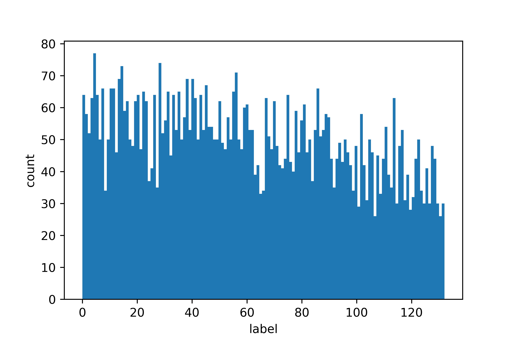

## Project Overview

Welcome to Dog Breed Detection app. With this web application you'll be able to 
upload an image of your choosing and determine the dog breed. If the image is that of a human, the app will determin the dog breed that looks alike.
  


This app uses convolutional neural networks (CNN) and transfer learning to predict the dog bread
using a neural network with 133 outputs (the total number of breeds that we have data available for).

## Basic usage

1. Clone the repository 
```	
git clone https://github.com/hosseinsadeghi/breeddetection.git
cd breeddetection
```

2. Donwload the [VGG-16 bottleneck features](https://s3-us-west-1.amazonaws.com/udacity-aind/dog-project/DogInceptionV3.npz) for the dog dataset.  Place it in the repo, at location `path/to/dog-project/bottleneck_features`.

3. Install all the requirements by
```
python -m pip install -r requirements.txt
```

4. (Optional) Install TensorFlow with GPU support, follow [the guide](https://www.tensorflow.org/install/) to install the necessary NVIDIA software on your system.  If you are using an EC2 GPU instance, you can skip this step.

5. Run the app
```
python run.py
```

## Algorithm

To classify dog images we have used InceptionV3 which is an advanced CNN model with Inception layer that consist of three
parallel 1x1 and a 3x3 max pooling layer. Each of the parallel convolutions except one of the 1x1, are followed by 3x3, 
5x5 and 1x1 convolution layers. At the end of each Inception layer the output of the parallel layers are concatenated
to produce the output layer. The 1x1 convolution can be thought of as a dense layer of `num_filters_in x num_filters_out` for each 
pixel. 


The Inception model has approximately seven million parameters. Our data set of dog images has small number of images.
If we wanted to train the classifier directly on our images we would have run into over-fitting issue.

Most images have many features in common such as edges, color combination, shapes, etc. We can use a previously trained 
model of Inception with Imagenet data set with over 14 millions images to transfer some of the knowledge about images to
out own model. It is a common practice in transfer learning to use a pretrained model with extra layers tha adapts to the 
new data and then fine tune the parameters of the larger pretrained network. In this work, however, we will not fine tune
the pre-trained model.

In order to detect the breed of each dog we use a classifier model that uses labeled data to predict the label of each
image. There are 133 breeds in our data set, for this reason we create a neural network with an output size of 133 neurals
each predicting the weight of a categorical distribution.

```
_________________________________________________________________
Layer (type)                 Output Shape              Param #   
=================================================================
global_average_pooling2d_2 ( (None, 2048)              0         
_________________________________________________________________
dense_3 (Dense)              (None, 256)               524544    
_________________________________________________________________
dense_4 (Dense)              (None, 133)               34181     
=================================================================
Total params: 558,725
Trainable params: 558,725
Non-trainable params: 0
_________________________________________________________________
```

After transforming the input images with the pre-trained model, we need to learn how to transform the feature maps to
the 133 weights of each class. We first use a global average pooling to collapse all the feature maps to an array of 
size `num_filters` which is 2048 for the Inception module with the top removed.

We further use a dense layer with 256 neurons to be able to learn a complex function of each of the features to better
predict the labels.

## Data set
Our data set consist of 8351 images with 133 distinct categories. We split the data into data of size
6680, 835, and 836 for training, validation, and test, respectively.

The images are of various size, we use preprocessing to match the size of each image to have the shape
(224, 244, 3) which matched the input size of the Inception model.

The model is trained for 100 epochs with batch size of 20. The model is saved every time the performance 
is improved.

We measure the performance by looking at the classification accuracy of the validation data set. Since the 
distribution of classes is only slightly unbalanced, we can safely use accuracy as a measure of performance. 
After selection based on score on validation set, we achieve 77.5% accuracy on the test set.



```
|0    |Affenpinscher                           |64    |1    |Afghan hound                            |58   |
------------------------------------------------------------------------------------------------------------
|2    |Airedale terrier                        |52    |3    |Akita                                   |63   |
------------------------------------------------------------------------------------------------------------
|4    |Alaskan malamute                        |77    |5    |American eskimo dog                     |64   |
------------------------------------------------------------------------------------------------------------
|6    |American foxhound                       |50    |7    |American staffordshire terrier          |66   |
------------------------------------------------------------------------------------------------------------
|8    |American water spaniel                  |34    |9    |Anatolian shepherd dog                  |50   |
------------------------------------------------------------------------------------------------------------
|10   |Australian cattle dog                   |66    |11   |Australian shepherd                     |66   |
------------------------------------------------------------------------------------------------------------
|12   |Australian terrier                      |46    |13   |Basenji                                 |69   |
------------------------------------------------------------------------------------------------------------
|14   |Basset hound                            |73    |15   |Beagle                                  |59   |
------------------------------------------------------------------------------------------------------------
|16   |Bearded collie                          |62    |17   |Beauceron                               |50   |
------------------------------------------------------------------------------------------------------------
|18   |Bedlington terrier                      |48    |19   |Belgian malinois                        |62   |
------------------------------------------------------------------------------------------------------------
|20   |Belgian sheepdog                        |64    |21   |Belgian tervuren                        |47   |
------------------------------------------------------------------------------------------------------------
|22   |Bernese mountain dog                    |65    |23   |Bichon frise                            |62   |
------------------------------------------------------------------------------------------------------------
|24   |Black and tan coonhound                 |37    |25   |Black russian terrier                   |41   |
------------------------------------------------------------------------------------------------------------
|26   |Bloodhound                              |64    |27   |Bluetick coonhound                      |35   |
------------------------------------------------------------------------------------------------------------
|28   |Border collie                           |74    |29   |Border terrier                          |52   |
------------------------------------------------------------------------------------------------------------
|30   |Borzoi                                  |56    |31   |Boston terrier                          |65   |
------------------------------------------------------------------------------------------------------------
|32   |Bouvier des flandres                    |45    |33   |Boxer                                   |64   |
------------------------------------------------------------------------------------------------------------
|34   |Boykin spaniel                          |53    |35   |Briard                                  |65   |
------------------------------------------------------------------------------------------------------------
|36   |Brittany                                |50    |37   |Brussels griffon                        |57   |
------------------------------------------------------------------------------------------------------------
|38   |Bull terrier                            |69    |39   |Bulldog                                 |53   |
------------------------------------------------------------------------------------------------------------
|40   |Bullmastiff                             |69    |41   |Cairn terrier                           |63   |
------------------------------------------------------------------------------------------------------------
|42   |Canaan dog                              |50    |43   |Cane corso                              |64   |
------------------------------------------------------------------------------------------------------------
|44   |Cardigan welsh corgi                    |53    |45   |Cavalier king charles spaniel           |67   |
------------------------------------------------------------------------------------------------------------
|46   |Chesapeake bay retriever                |54    |47   |Chihuahua                               |54   |
------------------------------------------------------------------------------------------------------------
|48   |Chinese crested                         |50    |49   |Chinese shar-pei                        |50   |
------------------------------------------------------------------------------------------------------------
|50   |Chow chow                               |62    |51   |Clumber spaniel                         |49   |
------------------------------------------------------------------------------------------------------------
|52   |Cocker spaniel                          |47    |53   |Collie                                  |57   |
------------------------------------------------------------------------------------------------------------
|54   |Curly-coated retriever                  |50    |55   |Dachshund                               |65   |
------------------------------------------------------------------------------------------------------------
|56   |Dalmatian                               |71    |57   |Dandie dinmont terrier                  |50   |
------------------------------------------------------------------------------------------------------------
|58   |Doberman pinscher                       |47    |59   |Dogue de bordeaux                       |60   |
------------------------------------------------------------------------------------------------------------
|60   |English cocker spaniel                  |61    |61   |English setter                          |53   |
------------------------------------------------------------------------------------------------------------
|62   |English springer spaniel                |53    |63   |English toy spaniel                     |39   |
------------------------------------------------------------------------------------------------------------
|64   |Entlebucher mountain dog                |42    |65   |Field spaniel                           |33   |
------------------------------------------------------------------------------------------------------------
|66   |Finnish spitz                           |34    |67   |Flat-coated retriever                   |63   |
------------------------------------------------------------------------------------------------------------
|68   |French bulldog                          |51    |69   |German pinscher                         |47   |
------------------------------------------------------------------------------------------------------------
|70   |German shepherd dog                     |62    |71   |German shorthaired pointer              |48   |
------------------------------------------------------------------------------------------------------------
|72   |German wirehaired pointer               |42    |73   |Giant schnauzer                         |41   |
------------------------------------------------------------------------------------------------------------
|74   |Glen of imaal terrier                   |44    |75   |Golden retriever                        |64   |
------------------------------------------------------------------------------------------------------------
|76   |Gordon setter                           |43    |77   |Great dane                              |40   |
------------------------------------------------------------------------------------------------------------
|78   |Great pyrenees                          |59    |79   |Greater swiss mountain dog              |46   |
------------------------------------------------------------------------------------------------------------
|80   |Greyhound                               |56    |81   |Havanese                                |61   |
------------------------------------------------------------------------------------------------------------
|82   |Ibizan hound                            |46    |83   |Icelandic sheepdog                      |50   |
------------------------------------------------------------------------------------------------------------
|84   |Irish red and white setter              |37    |85   |Irish setter                            |53   |
------------------------------------------------------------------------------------------------------------
|86   |Irish terrier                           |66    |87   |Irish water spaniel                     |51   |
------------------------------------------------------------------------------------------------------------
|88   |Irish wolfhound                         |53    |89   |Italian greyhound                       |58   |
------------------------------------------------------------------------------------------------------------
|90   |Japanese chin                           |57    |91   |Keeshond                                |44   |
------------------------------------------------------------------------------------------------------------
|92   |Kerry blue terrier                      |35    |93   |Komondor                                |44   |
------------------------------------------------------------------------------------------------------------
|94   |Kuvasz                                  |49    |95   |Labrador retriever                      |43   |
------------------------------------------------------------------------------------------------------------
|96   |Lakeland terrier                        |50    |97   |Leonberger                              |46   |
------------------------------------------------------------------------------------------------------------
|98   |Lhasa apso                              |42    |99   |Lowchen                                 |34   |
------------------------------------------------------------------------------------------------------------
|100  |Maltese                                 |48    |101  |Manchester terrier                      |29   |
------------------------------------------------------------------------------------------------------------
|102  |Mastiff                                 |58    |103  |Miniature schnauzer                     |42   |
------------------------------------------------------------------------------------------------------------
|104  |Neapolitan mastiff                      |31    |105  |Newfoundland                            |50   |
------------------------------------------------------------------------------------------------------------
|106  |Norfolk terrier                         |46    |107  |Norwegian buhund                        |26   |
------------------------------------------------------------------------------------------------------------
|108  |Norwegian elkhound                      |45    |109  |Norwegian lundehund                     |33   |
------------------------------------------------------------------------------------------------------------
|110  |Norwich terrier                         |44    |111  |Nova scotia duck tolling retriever      |54   |
------------------------------------------------------------------------------------------------------------
|112  |Old english sheepdog                    |39    |113  |Otterhound                              |35   |
------------------------------------------------------------------------------------------------------------
|114  |Papillon                                |63    |115  |Parson russell terrier                  |30   |
------------------------------------------------------------------------------------------------------------
|116  |Pekingese                               |48    |117  |Pembroke welsh corgi                    |53   |
------------------------------------------------------------------------------------------------------------
|118  |Petit basset griffon vendeen            |31    |119  |Pharaoh hound                           |39   |
------------------------------------------------------------------------------------------------------------
|120  |Plott                                   |28    |121  |Pointer                                 |32   |
------------------------------------------------------------------------------------------------------------
|122  |Pomeranian                              |44    |123  |Poodle                                  |50   |
------------------------------------------------------------------------------------------------------------
|124  |Portuguese water dog                    |34    |125  |Saint bernard                           |30   |
------------------------------------------------------------------------------------------------------------
|126  |Silky terrier                           |41    |127  |Smooth fox terrier                      |30   |
------------------------------------------------------------------------------------------------------------
|128  |Tibetan mastiff                         |48    |129  |Welsh springer spaniel                  |44   |
------------------------------------------------------------------------------------------------------------
|130  |Wirehaired pointing griffon             |30    |131  |Xoloitzcuintli                          |26   |
------------------------------------------------------------------------------------------------------------
|132  |Yorkshire terrier                       |30   
------------------------------------------------------------------------------------------------------------
____________________________________________________________________________________________________________
```

We can further improve our model by adding batch normalization the dense layers, dropout, and careful
training procedure, for example, decrease learning rate throughout the training to reduce training noise
produce by small batch size.   
 
  
    

## Navigating the app

You'll find a button `upload file` that allows you to upload your file of interest. Then click upload. If successful you'll see a message indicating that the
upload was successful. After a few seconds, you'll see your image as well as the image of a dog that looks like the dog image or face image that you uploaded.

## Credit

Many of the basic codes are taken from this repo from [Udacity](https://github.com/udacity/dog-project.git).

The snapshot of the app contains an image of [Weird Al](https://images.app.goo.gl/YDcdvvrA5thoPNDL8).

To train our model we have use the data set from [dog dataset](https://s3-us-west-1.amazonaws.com/udacity-aind/dog-project/dogImages.zip).